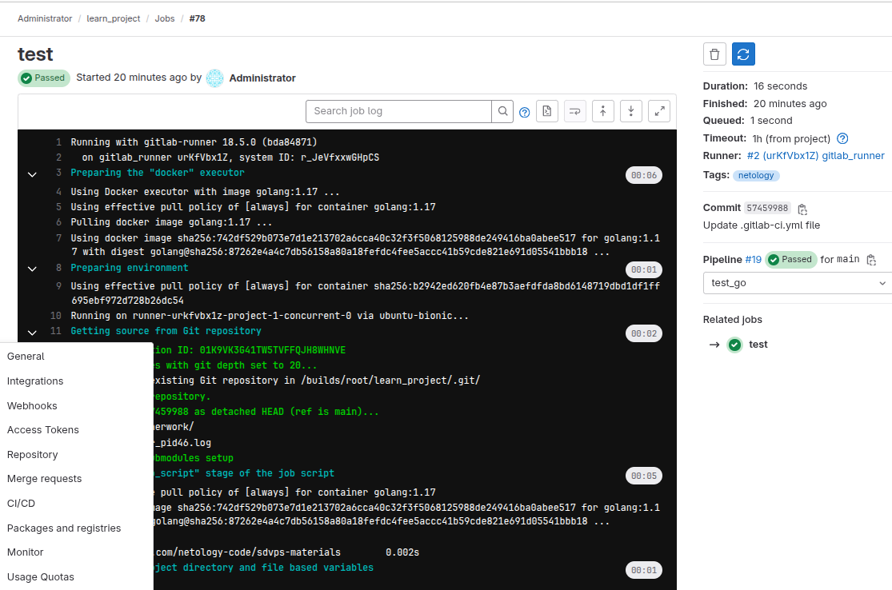
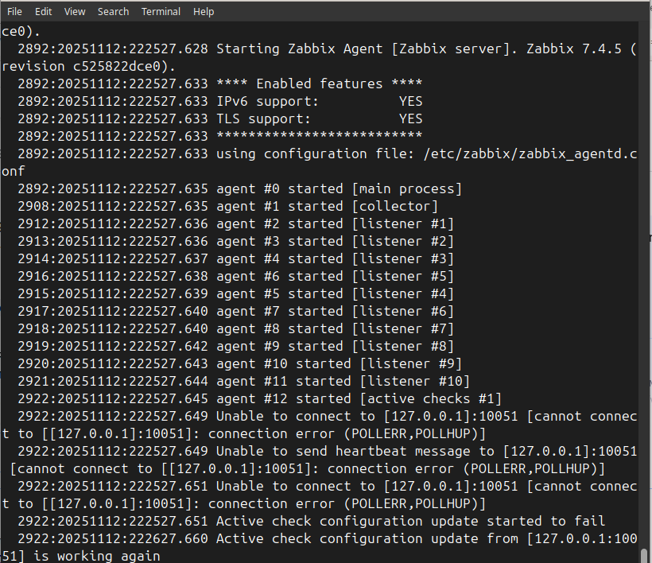

# Домашнее задание к занятию "Система мониторинга Zabbix" - Карпов Антон Юрьевич

### Задание 1

Установите Zabbix Server с веб-интерфейсом.

# Процесс выполнения

1. Выполняя ДЗ, сверяйтесь с процессом отражённым в записи лекции.
2. Установите PostgreSQL. Для установки достаточна та версия, что есть в системном репозитороии Debian 11.
3. Пользуясь конфигуратором команд с официального сайта, составьте набор команд для установки последней версии Zabbix с поддержкой PostgreSQL и Apache.
4. Выполните все необходимые команды для установки Zabbix Server и Zabbix Web Server.

# Требования к результатам

1. Прикрепите в файл README.md скриншот авторизации в админке.
2. Приложите в файл README.md текст использованных команд в GitHub.

### Решение 1

 # Скриншот успешной авторизации

 

 # Последовательность команд

 ```
 # Установка PGSql 
 - su
 sudo apt install postgresql 

#Скачивание и установка Zabbix
 sudo s-
 wget https://repo.zabbix.com/zabbix/7.4/release/ubuntu/pool/main/z/zabbix-release/zabbix-release_latest_7.4+ubuntu24.04_all.deb
 dpkg -i zabbix-release_latest_7.4+ubuntu24.04_all.deb
 apt update

 apt install zabbix-server-pgsql zabbix-frontend-php php8.3-pgsql zabbix-apache-conf zabbix-sql-scripts

 sudo -u postgres createuser --pwprompt zabbix
 sudo -u postgres createdb -O zabbix zabbix

 zcat /usr/share/zabbix/sql-scripts/postgresql/server.sql.gz | sudo -u zabbix psql zabbix

#Установка пароля к БД
 sed -i 's/# DBPassword=/DBPassword=1234567890/g' /etc/zabbix/zabbix_server.conf

#Рестарт и автозапуск сервиса
 systemctl restart zabbix-server apache2
 systemctl enable zabbix-server apache2
 ```

### Задание 2

Установите Zabbix Agent на два хоста.

# Процесс выполнения

1. Выполняя ДЗ, сверяйтесь с процессом отражённым в записи лекции.
2. Установите Zabbix Agent на 2 вирт.машины, одной из них может быть ваш Zabbix Server.
3. Добавьте Zabbix Server в список разрешенных серверов ваших Zabbix Agentов.
4. Добавьте Zabbix Agentов в раздел Configuration > Hosts вашего Zabbix Servera.
5. Проверьте, что в разделе Latest Data начали появляться данные с добавленных агентов.

# Требования к результатам

1. Приложите в файл README.md скриншот раздела Configuration > Hosts, где видно, что агенты подключены к серверу
2. Приложите в файл README.md скриншот лога zabbix agent, где видно, что он работает с сервером
3. Приложите в файл README.md скриншот раздела Monitoring > Latest data для обоих хостов, где видны поступающие от агентов данные.
4. Приложите в файл README.md текст использованных команд в GitHub

### Решение 2

Cкриншот раздела Configuration > Hosts, где видно, что агенты подключены к серверу:


Cкриншот лога zabbix agent, где видно, что он работает с сервером:



Cкриншот раздела Monitoring > Latest data для обоих хостов, где видны поступающие от агентов данные:


Tекст использованных команд:

```
sudo -s
wget https://repo.zabbix.com/zabbix/7.4/release/ubuntu/pool/main/z/zabbix-release/zabbix-release_latest_7.4+ubuntu18.04_all.deb
dpkg -i zabbix-release_latest_7.4+ubuntu18.04_all.deb
apt update

apt install zabbix-agent

systemctl restart zabbix-agent
systemctl enable zabbix-agent
```


