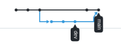

# Домашнее задание к занятию "GitLab" - Карпов Антон Юрьевич

### Задание 1

# Что нужно сделать:

1. Разверните GitLab локально, используя Vagrantfile и инструкцию, описанные в этом репозитории.
2. Создайте новый проект и пустой репозиторий в нём.
3. Зарегистрируйте gitlab-runner для этого проекта и запустите его в режиме Docker. Раннер можно регистрировать и запускать на той же виртуальной машине, на которой запущен GitLab.

В качестве ответа в репозиторий шаблона с решением добавьте скриншоты с настройками раннера в проекте.

### Решение 1

Скриншот с настройками раннера после его создания:


### Задание 2

# Что нужно сделать:

1. Запушьте репозиторий на GitLab, изменив origin. Это изучалось на занятии по Git.
2. Создайте .gitlab-ci.yml, описав в нём все необходимые, на ваш взгляд, этапы.

В качестве ответа в шаблон с решением добавьте:

* файл gitlab-ci.yml для своего проекта или вставьте код в соответствующее поле в шаблоне;
* скриншоты с успешно собранными сборками.

### Решение 2

Код gitlab-ci.yml:

```yaml
stages:
  - test_go
  - test_sonar
  - build

test:
  stage: test_go
  image: golang:1.17
  script: 
   - go test .
  tags:
    - netology

sonarqube-check:
 stage: test_sonar
 image:
  name: sonarsource/sonar-scanner-cli
  entrypoint: [""]
 variables:
 script:
  - sonar-scanner -Dsonar.projectKey=gitlab_hw -Dsonar.sources=. -Dsonar.host.url=http://gitlab.localdomain:9000 -Dsonar.login=sqp_fb904e79bfa891a242a19246e51b55b2fcc90945
 tags:
  - netology

build:
  stage: build
  image: docker:latest
  script:
   - docker build .
  tags:
   - netology
```


### Результат сборки

Общий:



Stage test_go:


Stage sonarqube-check:


Stage build:


